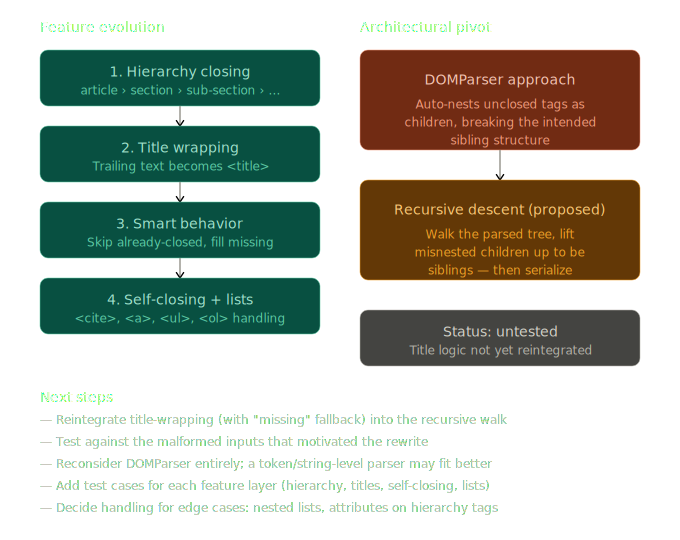

https://claude.ai/share/5e44c794-80aa-4c55-a917-8b27791d0b6b



I'll create a detailed markdown document summarizing this work.Now I'll create a detailed markdown document and a visual diagram of the workflow.Now let me write the detailed markdown document.Here's the diagram showing how this work evolved. Now let me create a markdown file with the full documentation:Let me give you the documentation directly here, since I don't have file-creation tools available in this session:

# HTML Tag Closer — Session Notes

## Goal

Build a JavaScript function that takes a malformed HTML document — one where hierarchical structural tags have been left unclosed — and returns a well-formed version. The function operates on a custom hierarchy of structural tags:

```
article > section > sub-section > sub-sub-section > sub-sub-sub-section
```

The closing rule: when a tag at level *N* is encountered, any open tags at level *N* or deeper should be closed before it. By the end of the document, every opened hierarchy tag should be closed.

The scope expanded over the course of the session to include title wrapping, idempotent ("smart") behavior, self-closing inline tags, and markdown-style list parsing inside `<ul>` and `<ol>`.

## What was accomplished

**Feature 1 — Hierarchy tag closing.** Implemented a stack-based pass that closes any open tag of equal-or-higher level when a new hierarchy tag is encountered. A trailing pass closes whatever is left on the stack at end-of-document. Verified working against the original example.

**Feature 2 — Title wrapping.** Extended the function so that text appearing on the same line as an opening hierarchy tag (between the tag and the newline) gets wrapped in a `<title>` element. For example, `<section> First Section\ntext\n` becomes `<section> <title>First Section</title>\ntext\n`. Verified working.

**Feature 3 — "Smart" idempotent behavior.** Added three intelligence checks so the function can be safely re-run on partially-correct documents: don't insert a closing tag if the tag is already properly closed; don't re-wrap text that's already inside a `<title>`; when an opening hierarchy tag has no following non-whitespace text, insert `<title>missing</title>` as a placeholder.

**Feature 4 — Self-closing inline tags + list parsing.** Two final additions: the tags `<cite>`, `<aside>`, `<a>`, `<ref-sec>`, `<ref-eq>`, `<ref-fig>`, `<ref-table>`, `<ref-code>` get an immediate closing tag inserted right after them if left open (using a `data-closed` attribute as an idempotency marker); text between `<ul>` or `<ol>` tags is parsed as markdown-style lists where each line becomes an `<li>` and leading numbering like `1. ` is stripped.

**The architectural pivot.** The breakthrough at the end of the session: you correctly identified that `DOMParser` is the wrong primitive for this job. When `DOMParser` encounters `<section><div>a<section><h2>b`, it doesn't see two sibling sections — it nests the second section *inside* the div, *inside* the first section, because the first section was never closed. So all the stack-based logic was working against a tree that had already lost the structural information we cared about. The proposed fix: parse with `DOMParser` anyway to get a working tree, but then walk it with recursive descent, lifting misnested children out to become siblings when their hierarchy level says they should be. After the tree is repaired, serialize back to HTML. A first-pass implementation was sketched out, but it does **not** yet integrate the title-wrapping logic, and it has not been tested.

## Final code (untested)

```javascript
function closeUnclosedhierarchyTags(html) {
  const hierarchyTags = ['article', 'section', 'sub-section', 'sub-sub-section', 'sub-sub-sub-section'];
  const immediateCloseTags = ['cite', 'aside', 'a', 'ref-sec', 'ref-eq', 'ref-fig', 'ref-table', 'ref-code'];

  const parser = new DOMParser();
  const doc = parser.parseFromString(html, 'text/html');
  const body = doc.body;

  function unnestElements(element, level) {
    const children = Array.from(element.children);

    for (let i = 0; i < children.length; i++) {
      const child = children[i];
      const tagName = child.tagName.toLowerCase();

      if (hierarchyTags.includes(tagName)) {
        const currentLevel = hierarchyTags.indexOf(tagName);

        if (currentLevel <= level) {
          element.removeChild(child);
          element.parentNode.insertBefore(child, element.nextSibling);
          i--;
        } else {
          unnestElements(child, currentLevel);
        }
      } else if (immediateCloseTags.includes(tagName) && !child.hasAttribute('data-closed')) {
        child.insertAdjacentHTML('afterend', `</${tagName}>`);
        child.setAttribute('data-closed', 'true');
      } else if (tagName === 'ul' || tagName === 'ol') {
        const listItems = child.textContent.trim().split('\n');
        child.textContent = '';

        listItems.forEach(item => {
          const listItem = doc.createElement('li');
          listItem.textContent = item.trim().replace(/^\d+\.\s*/, '');
          child.appendChild(listItem);
        });
      }
    }
  }

  unnestElements(body, -1);

  return body.innerHTML;
}
```

## Next steps

When you pick this back up:

1. **Reintegrate the title-wrapping logic** into the recursive walk. The Feature 3 version handled this well — the smart logic (skip if already wrapped, fill missing with `<title>missing</title>`) needs to come along into the new architecture.

2. **Test against the malformed inputs that motivated the rewrite**, especially the diagnostic case `<section><div>a<section><h2>b`. Add coverage for hierarchy tags interleaved with non-hierarchy tags like `<div>`.

3. **Reconsider whether `DOMParser` is the right tool at all.** You're already fighting it — its auto-nesting behavior is the root cause of the original bug. Two alternatives worth weighing: a token-level parser using regex over `<tag>` and `</tag>` patterns that emits HTML directly (simpler model, no DOM tree to repair), or a streaming SAX-style parser that calls handlers on open/close events (full control over structural decisions).

4. **Build a proper test suite.** Each of the four features needs its own coverage: hierarchy closing, title wrapping, smart/idempotent behavior, and self-closing/list handling. Plus combinations.

5. **Decide on edge-case handling.** Open questions: nested `<ol>` inside `<ol>`? Hierarchy tags with attributes like `<section id="intro">` — does title-wrapping still work? Self-closing tag inside a `<title>` — close immediately or skip? HTML entities in title text — preserve, decode, re-encode?

## State at end of session

You were going to sleep before testing Feature 4, and then came back and diagnosed the deeper structural problem with `DOMParser`. The recursive-descent code is a sketch — directionally right, mechanically incomplete. Treat it as a starting point for the next session, not a finished solution.

---

One quick note: this kind of project — building and testing a JavaScript file iteratively — is exactly what Claude Code is designed for. If you'd like to keep working on this with file-level edits, a test runner, and the ability to actually execute the code as you go, that'd be a much better fit than the chat interface. The desktop app is also worth having for longer coding sessions.

